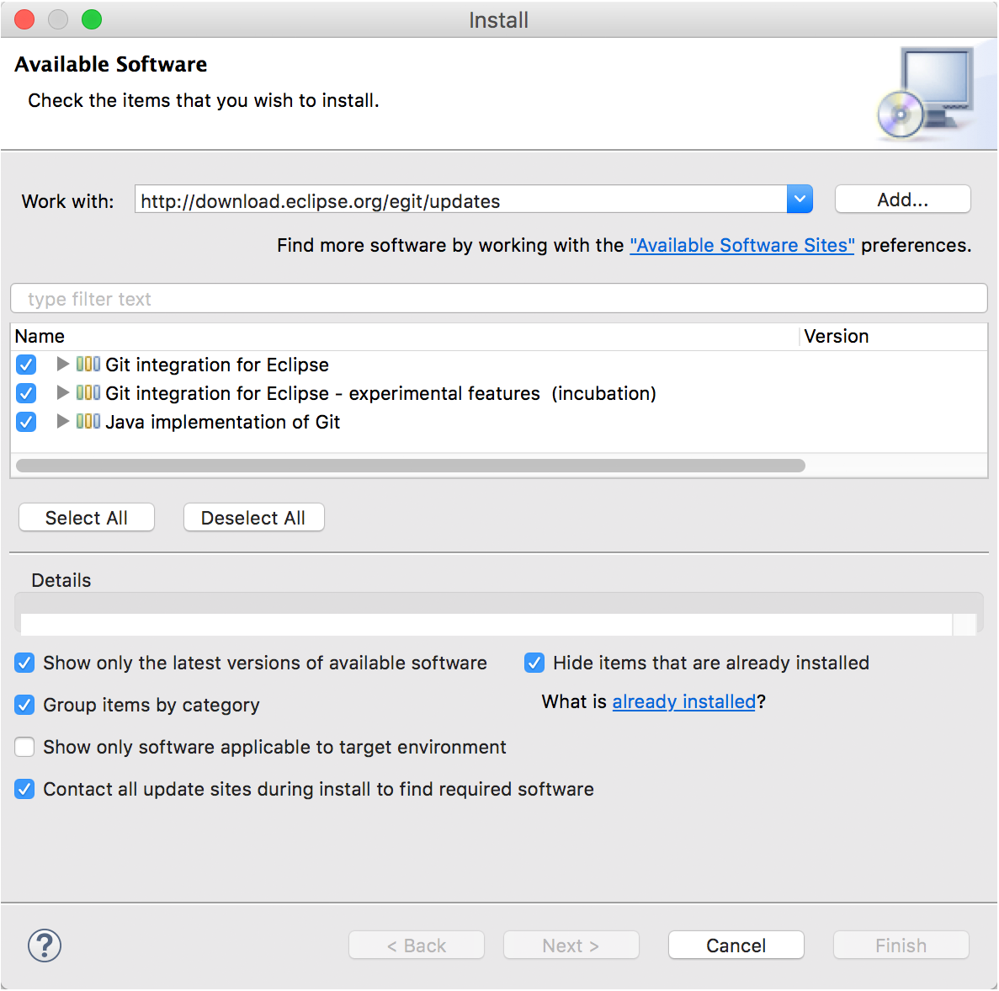
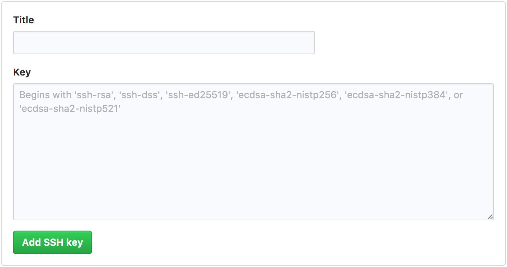
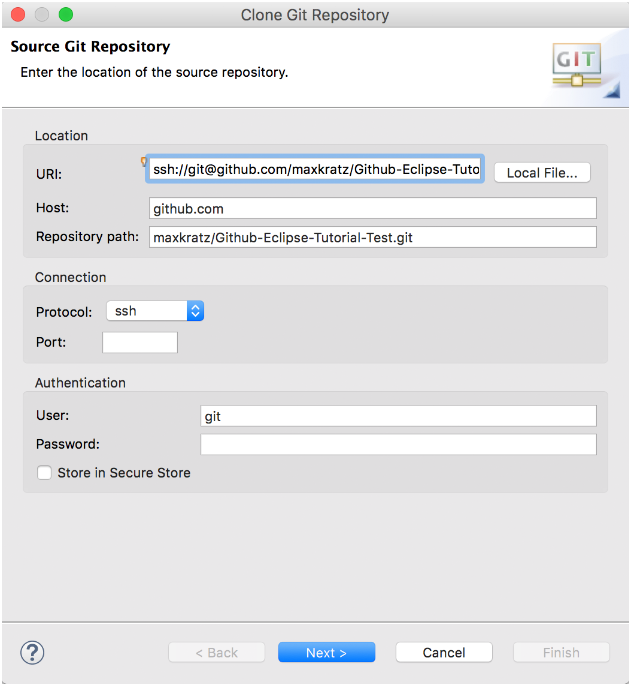
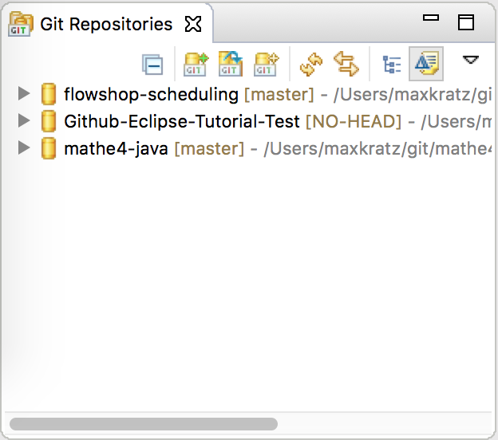
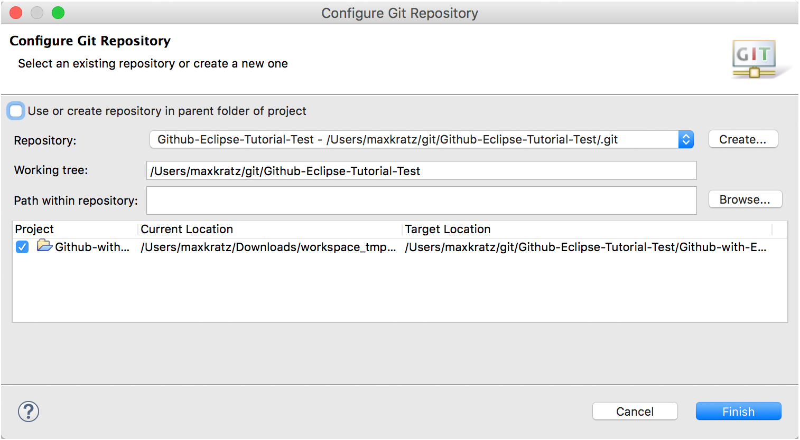
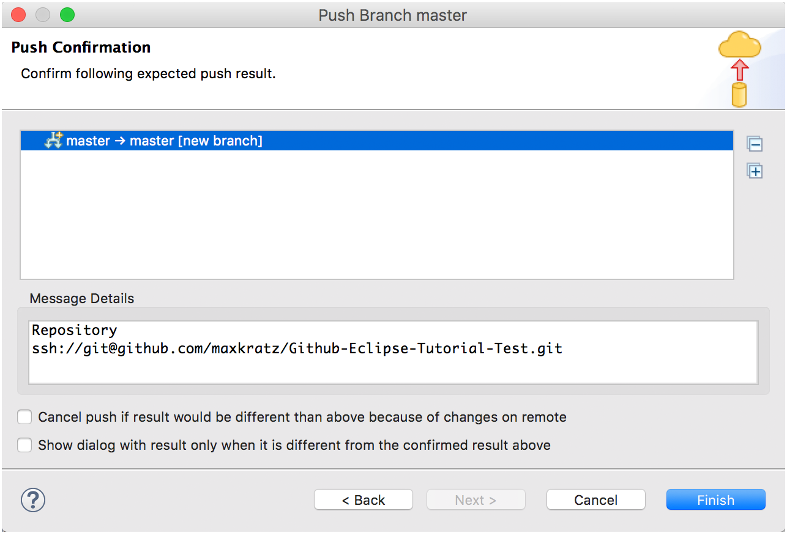
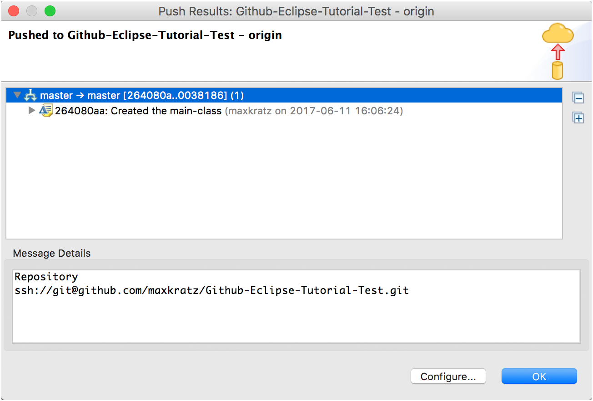

# How to use Eclipse with Github
This is a tutorial on how to use Eclipse with Github.

## Requirements
The latest version of Eclipse can be downloaded from [here](https://www.eclipse.org/downloads/) and of course a [Github-Account](https://github.com) is needed.

## First Step: Install EGit in Eclipse
For uploading code from eclipse, the egit-plugin is needed. 
  
* In Eclipse, go to **Help/Install new Software...**
* Paste *http://download.eclipse.org/egit/updates* in **Work with:** and click **Add** 
* Select all of the options and click **Next**
* Accept all of the license agreements and finish the installation.
  

## Create a public DSA-Key in Eclipse
For the authentification with Github, it is neccessary to create a secure key which is known by the local Eclipse-installation and the Github-service.  

* In Eclipse, go to **Preferences/General/Network Connections/SSH2**
* Select **Key Management**
* Click on **Generate DSA Key...**

* At the bottom of the window, type in a secret passphrase
* Click on **Save Private Key...** and save the file at a well known location.

## Register your DSA-Key with Github
* Open your previous generated file with a text-editor (e.g. Notepad or SublimeText) and copy the whole text to your clipboard (**STRG+C/CMD+C**)
* On the Github-page go to your **Settings/SSH and GPG keys**
* Click on **New SSH key**
* Select a title of your choice and paste the previous copied text from your clipboard into the **Key**-field (**STRG+V/CMD+V**)
* Click on **Add SSH key**

## Create a new Repository on Github
* On Github click on **New repository** and give the new repository a name
* Do NOT select the option **Initialize this repository with a README**
* Click on **Create repository**

## Import the Github Repository in Eclipse
* In Eclipse, go to **Window/Show View/Other...**
* Select **Git/Git Repositories**
* A new view should appear
* Click on **Clone a Git repository**
* Paste your Repository-URL from Github in the URL-field (be sure to copy the ssh-URL from the Repository page on Github with something like **git@github.com** at the beginnig)
  

* Select ssh as **Protocol**
* Click **Next** (there is no authentification needed)
  

* Click **Next** again
* Click **Finish**
* When you close the message of the git repository from github, you should define a repository location (e.g. in your home-folder on your system) if Eclipse prompts you to do so
* You should now have a GIT-view of your repositories (probably just one)

## Link Eclipse-Projects with your Repository
You have to link your Eclipse-Projects with your Github-Repository to push data to Github.   

* Right click on your project **Team/Share Project...**
* Select your repository and click **Finish**

## Upload source-files to Github
* Click on your repository (in the repository-view)
* Drag all entries from the field **Unstaged Changes(n)** to the filed **Staged Changes(m)**
* Write a nice **Commit Message** like *This is my first commit*
* Click **Commit and Push...**
  

* Click **Next**
 

* Click **Finish**
  

* Eclipse prompts you with a message that the data is pushed
* Click **OK**

## The end
The upload of your project to Github is finished. You can now open the repository on Github and check your source-files.

## References
[Max Rohde - Eclipse and Github Tutorial](https://maxrohde.com/2012/05/25/eclipse-and-github-tutorial/)  
[Git with Eclipse (EGit) – Tutorial](http://www.vogella.com/articles/EGit/article.html)  
[Getting Started with Git, EGit, Eclipse, and GitHub](http://jeromyanglim.blogspot.co.nz/2010/11/getting-started-with-git-egit-eclipse.html)  
[git push rejected (on stackoverflow)](http://stackoverflow.com/questions/620253/git-push-rejected)  
[A Short Tutorial on Eclipse/EGit/GitHub](http://npascut1.wordpress.com/2011/03/10/eclipseandgit/)  
[Using the EGit Eclipse Plugin with GitHub](http://loianegroner.com/2009/11/tutorial-using-the-egit-eclipse-plugin-with-github/)
